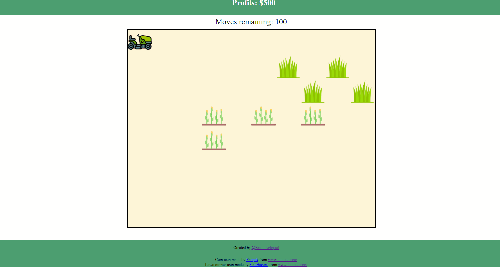

# Good Plant, Bad Plant

## Description
An agricultural game where you try to take out the nasty weeds and leave the good plants to grow. 

## Setup
To set up this project locally, open your terminal and navigate to the directory where you would like to clone the project. Copy the code link from the [Github repository](https://github.com/LINDGRENBA/good-plant-bad-plant) and run `git clone git@github.com:LINDGRENBA/good-plant-bad-plant.git` for ssh or `git clone https://github.com/LINDGRENBA/good-plant-bad-plant.git` for https in your terminal.

Once the project has been cloned, type `cd good-plant-bad-plant` into your terminal and press enter to navigate into the project. Then run `npm install` or `yarn install` to install all of the dependencies for the project.

To start the development server, type `npm start` or `yarn start`. Once the server has successfully started, open a window in your browser and navigate to the localhost. This is usually `localhost:3000`. You can confirm this is the correct Local address by checking in the terminal.

## Gameplay

### Mechanics :
The player can move the tractor with the up, down, left and right arrows on the keyboard.

### Components :
* Board: Field
* Player: Tractor
* Good plant: Corn
* Bad plant: Grass
* Moves counter
* Start Game Button
* Profit Points counter

### Objective :
Try to get as many profit points as possible before your moves run out.

### Rules :
* The tractor can only move up, down, left or right
* Mowing good plants (corn) decreases total profit points
* Mowing bad plants (grass) increases total profit points
* When the player runs out of moves, the game is over

### Constants:
consider adding constants for the following:
* FIELD_WIDTH
* FIELD_HEIGHT
* ICON_WIDTH
* ICON_HEIGHT
* TRACTOR_INITIAL_POSITION
* PERCENTAGE_RATE

<br/>

### Bugs and Errors Encountered:
1. Issue with Plant Generation
* Using the following code to call `createNewPlant()`
```  
useEffect(() => { 
    window.addEventListener("keydown", moveTractor);
    createNewPlant();

    return () => {
      window.removeEventListener("keydown", moveTractor)
    }
  }, [tractorPosition, plants]);
  ```
resulted in a single flash of plants which then disappeared, leaving an empty field.

* Wrapping `createNewPlant()` in a `setTimeout` function and adding `plants` to the `useEffect` dependency array appeared to work, but `plants` would not be generated while the `tractor` was being moved.

* Calling the `setInterval` function from useEffect resulted in some pretty interesting behavior...



I'm guessing this is due to how React re-renders components and how `useEffect` is functioning.

<br/>

### Solution: 
One option is to call `createNewPlant()` from the `moveTractor()` function, making the plant creation occur as the tractor moves. This is the approach I took in my initial test run, which can be found on the `practice-run` branch.

The other option is to create a second `useEffect` for `setInterval` and to pass `plants` to its dependency array. In order to avoid an infinite loop here, I added a start button which sets the state of `gameOver` to false and then based the continuation of `setInterval` on the value of `gameOver`.
Here is the second `useEffect` hook:
```
  useEffect(() => {
    const interval = setInterval(() => {
      if(!gameOver) {
          createNewPlant();
      }
    }, 2000);

    return () => {
      clearInterval(interval);
    }
  }, [plants]);
  ```
  The idea is for gameOver to be set to true once all `moves` have been used up at which point the setInterval function will stop running.

  * If you prefer to have plants be generated as soon as the page loaded, take the following steps:
  1. In `Header.js` comment out the button that triggers `startNewGame()`
  2. In `Game.js` comment out the `startNewGame` props that are being passed to header and also comment out the `startNewGame()` function
  3. At the top of `Game.js` set the initial state of `gameOver` to false


2. Issue with Plant Rendering if Space is Filled
* If the board is allowed to fill up and the randomly generated plant coordinates are already full, it can give the appearance that new plants are not being generated, as it takes longer for unfilled coordinates to be generated.

### Solution: 
In progress

3. `createNewPlant()` continues to run after `moves` hits zero and `gameOver` is set to true.

### Solution:
Add `gameOver` to the dependency array of the useEffect hook that is responsible for the setInterval


<br/>
<br/>
<br/>
<br/>
<br/>

## Getting Started with Create React App

This project was bootstrapped with [Create React App](https://github.com/facebook/create-react-app).

## Available Scripts

In the project directory, you can run:

### `yarn start`

Runs the app in the development mode.\
Open [http://localhost:3000](http://localhost:3000) to view it in the browser.

The page will reload if you make edits.\
You will also see any lint errors in the console.

### `yarn test`

Launches the test runner in the interactive watch mode.\
See the section about [running tests](https://facebook.github.io/create-react-app/docs/running-tests) for more information.

### `yarn build`

Builds the app for production to the `build` folder.\
It correctly bundles React in production mode and optimizes the build for the best performance.

The build is minified and the filenames include the hashes.\
Your app is ready to be deployed!

See the section about [deployment](https://facebook.github.io/create-react-app/docs/deployment) for more information.

### `yarn eject`

**Note: this is a one-way operation. Once you `eject`, you can’t go back!**

If you aren’t satisfied with the build tool and configuration choices, you can `eject` at any time. This command will remove the single build dependency from your project.

Instead, it will copy all the configuration files and the transitive dependencies (webpack, Babel, ESLint, etc) right into your project so you have full control over them. All of the commands except `eject` will still work, but they will point to the copied scripts so you can tweak them. At this point you’re on your own.

You don’t have to ever use `eject`. The curated feature set is suitable for small and middle deployments, and you shouldn’t feel obligated to use this feature. However we understand that this tool wouldn’t be useful if you couldn’t customize it when you are ready for it.

## Learn More

You can learn more in the [Create React App documentation](https://facebook.github.io/create-react-app/docs/getting-started).

To learn React, check out the [React documentation](https://reactjs.org/).

### Code Splitting

This section has moved here: [https://facebook.github.io/create-react-app/docs/code-splitting](https://facebook.github.io/create-react-app/docs/code-splitting)

### Analyzing the Bundle Size

This section has moved here: [https://facebook.github.io/create-react-app/docs/analyzing-the-bundle-size](https://facebook.github.io/create-react-app/docs/analyzing-the-bundle-size)

### Making a Progressive Web App

This section has moved here: [https://facebook.github.io/create-react-app/docs/making-a-progressive-web-app](https://facebook.github.io/create-react-app/docs/making-a-progressive-web-app)

### Advanced Configuration

This section has moved here: [https://facebook.github.io/create-react-app/docs/advanced-configuration](https://facebook.github.io/create-react-app/docs/advanced-configuration)

### Deployment

This section has moved here: [https://facebook.github.io/create-react-app/docs/deployment](https://facebook.github.io/create-react-app/docs/deployment)

### `yarn build` fails to minify

This section has moved here: [https://facebook.github.io/create-react-app/docs/troubleshooting#npm-run-build-fails-to-minify](https://facebook.github.io/create-react-app/docs/troubleshooting#npm-run-build-fails-to-minify)
